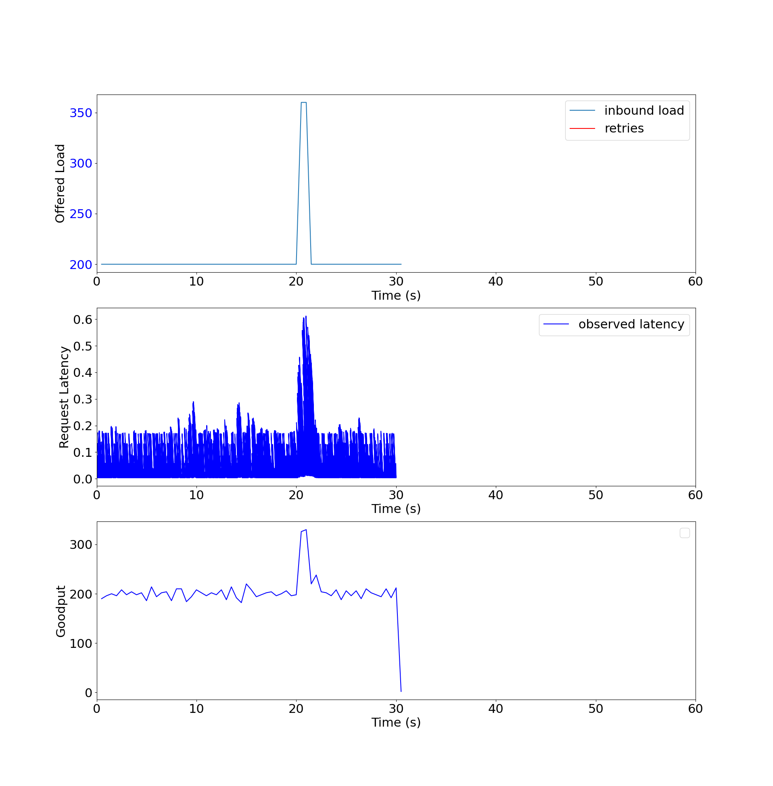

# bufferbloater
A configurable client/server bufferbloat simulation.

## Building

Just run `make`.

## Configuration

A basic configuration file looks something like this:
```
clients:
  - workload:
    - rps: 200
      duration: 20s
    - rps: 360
      duration: 1s
    - rps: 200
      duration: 9s
    rq_timeout: 500s
    retry_count: 0
    target_server:
      address: 127.0.0.1
      port: 9002
servers:
  - profile:
    - duration: 30s
      latency_distribution:
      - weight: 50
        latency: 3ms
    listen_port: 9002
    threads: 8

### Client

The client configuration allows a user to specify stages of variable durations
at a specific request rate (RPS). In the example above, the client will send
HTTP `GET` requests to `0.0.0.0:9002` at a rate of 10 RPS for 10 seconds,
followed by a rate of 20 RPS for 50 seconds. There are no retries, since `retry_count` is 0.

There may be more than one client!

### Server

The server configuration, similar to the client, allows a user to specify stages
in the server's lifetime. The `profile` field contains an obvious `duration
field`; however, the `latency_distribution` field controls how long the server
will spend "servicing" a request. The latency distributions can be weighted to
emulate desired tail latencies or more sophisticated service degradation.

The `threads` field controls how many worker threads are allowed to "service"
requests.

There may be more than one server!

## Generating data

CSV files are created for each run and placed in a folder specified by the `-data_dir` flag. If
files already exist in that folder, they will be overwritten. The bufferbloater will only create
files if there is data that needs to be written to it.

Be sure to have `matplotlib` and `numpy` installed.

There is a lot of polish left to do in this area. An example graph can be found
below.



### Example

An example command would look like this:
```
bufferbloater -config configs/intro.yaml -data_dir data && ./generate_report.py
```
